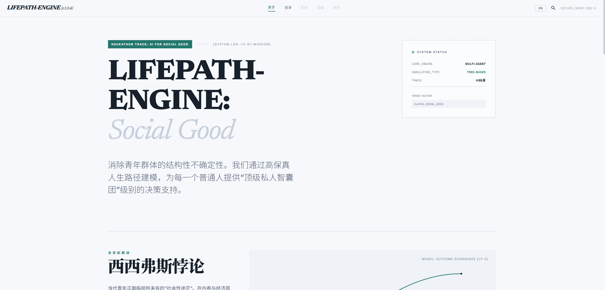
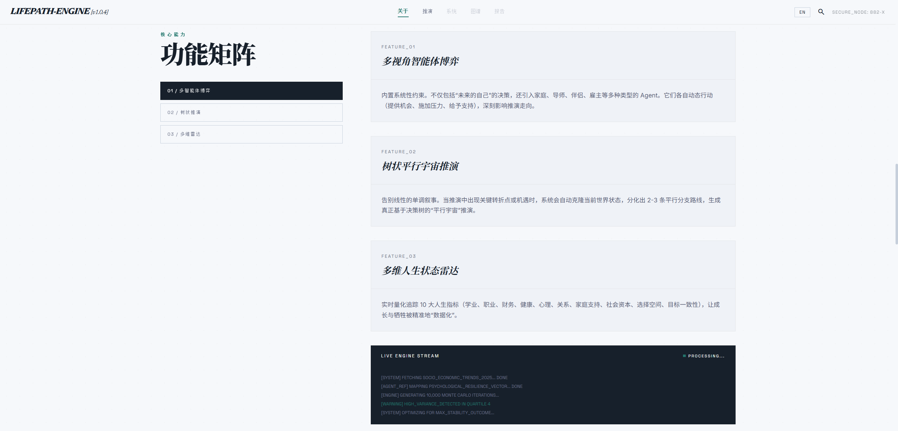
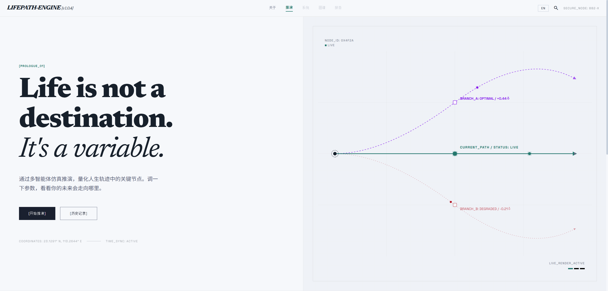
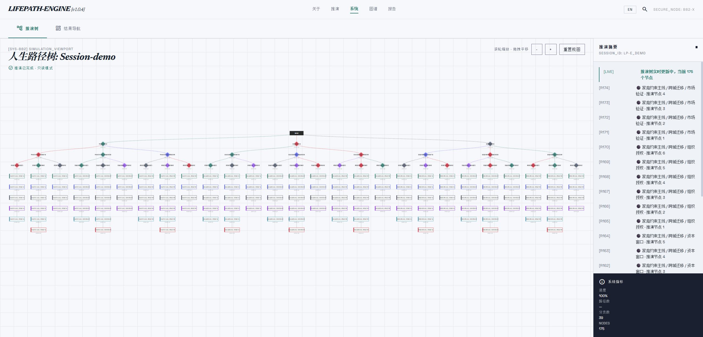
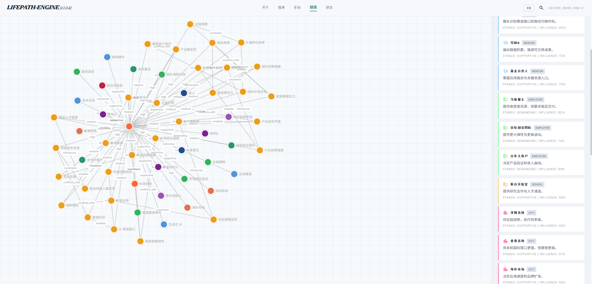
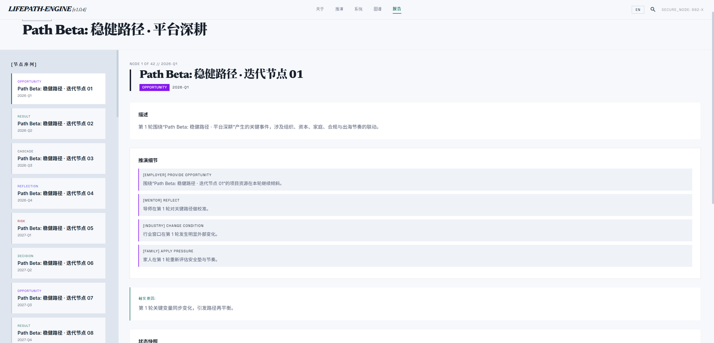
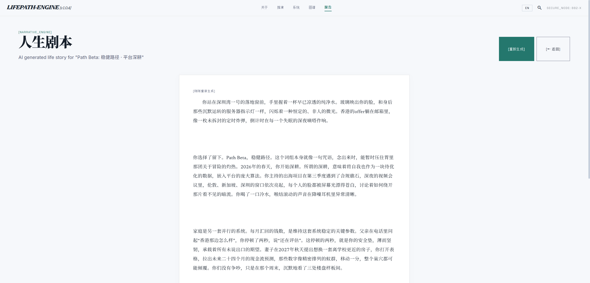
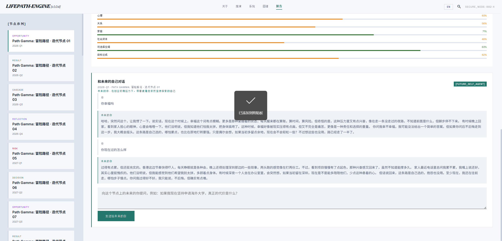

# LIFEPATH-ENGINE

**基于多智能体的人生抉择推演引擎 — 消除青年迷茫与信息差的"普惠型 AI 引路人"**

> Hackathon Track: AI for Social Good (AI 向善)

---

## 项目简介

LIFEPATH-ENGINE 是一款基于多智能体（Multi-Agent）技术构建的**人生推演引擎**。

用户输入当前的个人禀赋（教育、经济、性格等）和面临的关键选择节点，系统自动实例化多个代表不同利益与视角的 AI Agents（如跨界导师、家人、未来的自己、行业专家），在沙盘中进行动态博弈和链路推演，生成未来 3-10 年的多条反事实分支路径，帮助用户看见**一个当下的选择将如何通过连锁反应改变未来**。

它不是算命，不给唯一标准答案 —— 它是一个让普通人以极低成本"预演"不同人生选择的工具。

---

## 核心功能

### 多视角智能体博弈 (Multi-Agent Sandbox)

内置系统性约束，引入家庭、导师、伴侣、雇主等多种类型的 Agent，各自动态行动（提供机会、施加压力、给予支持），深刻影响推演走向。

### 树状平行宇宙推演 (Tree-Based Branching)

当推演中出现关键转折点时，系统自动克隆当前世界状态，分化出 2-3 条平行分支路线，生成真正基于决策树的"平行宇宙"推演。

### 多维人生状态雷达 (Life State Radar)

实时量化追踪 10 大人生指标：学业、职业、财务、健康、心理、关系、家庭支持、社会资本、选择空间、目标一致性。

### AI 策略建议与人生故事

针对每条推演路径，生成满意/不满意两种模式下的 AI 行动建议，并可将推演结果转化为可读的"人生故事"叙事。

---

## 技术架构

```
┌─────────────────────────────────────────────────┐
│                   Frontend (Vite)                │
│  Vanilla JS + CSS · D3.js · SPA Router · i18n   │
├─────────────────────────────────────────────────┤
│                Backend (FastAPI)                  │
│  Python 3.10+ · Uvicorn · Pydantic · SSE Stream │
├─────────────────────────────────────────────────┤
│              Core Engine Services                │
│  Multi-Agent Orchestration · Tree Derivation     │
│  LLM Client (OpenAI SDK) · Zep GraphRAG Memory  │
└─────────────────────────────────────────────────┘
```

| 层级 | 技术栈 | 说明 |
|------|--------|------|
| 前端 | Vite + Vanilla JS + CSS | SPA 路由、i18n 中英文切换、D3.js 知识图谱可视化 |
| 后端 | FastAPI + Uvicorn | RESTful API + SSE 实时事件流 |
| LLM | OpenAI SDK 兼容接口 | 支持 DeepSeek、阿里百炼 qwen、OpenAI 等 |
| 记忆 | Zep Cloud GraphRAG | 长期状态跟踪、知识图谱存储 |
| 存储 | JSON 文件存储 | 项目数据本地持久化 |

---

## 项目结构

```
hackthon/
├── backend/                  # 后端服务
│   ├── app/
│   │   ├── api/              # API 路由
│   │   ├── core/             # 核心配置 (config, db, llm)
│   │   ├── domain/           # 领域模型
│   │   ├── services/         # 推演引擎核心逻辑
│   │   └── main.py           # FastAPI 入口
│   ├── storage/              # 项目数据存储
│   └── requirements.txt      # Python 依赖
├── frontend/                 # 前端应用
│   ├── css/style.css         # 全局样式 (Design System)
│   ├── js/
│   │   ├── app.js            # SPA 路由 & 全局状态
│   │   ├── i18n.js           # 国际化 (中/英)
│   │   ├── api.js            # API 调用封装
│   │   └── pages/            # 页面组件
│   │       ├── about.js      # 项目介绍页
│   │       ├── landing.js    # 推演首页
│   │       ├── onboarding.js # 用户画像构建
│   │       ├── parameters.js # 推演参数配置
│   │       ├── simulation.js # 推演进行 & 推演树
│   │       ├── graph.js      # 知识图谱可视化
│   │       └── results.js    # 路径分析报告
│   ├── index.html
│   └── vite.config.js
├── docs/                     # 技术文档
├── .env                      # 环境变量配置
└── package.json              # 项目入口
```

---

## 快速开始

### 环境要求

- Node.js >= 18
- Python >= 3.10
- pip

### 1. 克隆项目

```bash
git clone https://github.com/SYSU-king/hackthon.git
cd hackthon
```

### 2. 配置环境变量

编辑根目录下的 `.env` 文件，填入 LLM API 和 Zep API 密钥：

```env
# LLM API 配置 (支持 OpenAI SDK 格式)
LLM_API_KEY=your_api_key
LLM_BASE_URL=https://api.deepseek.com/v1
LLM_MODEL_NAME=deepseek-chat

# Zep GraphRAG 记忆图谱
ZEP_API_KEY=your_zep_api_key
```

支持的 LLM 服务：
- [DeepSeek](https://platform.deepseek.com/)
- [阿里百炼](https://bailian.console.aliyun.com/) (qwen-plus)
- OpenAI 及任何兼容 OpenAI SDK 的 API

### 3. 安装依赖

```bash
# 安装前端依赖
npm install

# 安装后端 Python 依赖
cd backend
pip install -r requirements.txt
cd ..
```

### 4. 启动开发服务器

**方式 A：一键启动前后端**

```bash
npm run dev
```

**方式 B：分别启动**

```bash
# 终端 1 — 后端
npm run dev:backend

# 终端 2 — 前端
npm run dev:frontend
```

启动后访问 http://localhost:5173

---

## 使用流程

```
About (项目介绍)
  ↓
Landing (推演首页) → 开始推演
  ↓
Onboarding → 构建用户画像 (性格/教育/家庭/职业/核心困惑)
  ↓
Parameters → 定义关注参数 & 推演配置
  ↓
Simulation → 实时推演 (SSE 事件流 + 推演树实时渲染)
  ↓
Graph → 知识图谱可视化 (D3.js)
  ↓
Results → 路径分析报告 / AI 建议 / 人生故事
```

---

## 国际化

项目支持中英文切换，点击右上角语言按钮即可切换。所有页面文案均通过 `i18n.js` 统一管理。

---

## 社会价值

本项目旨在用 AI 构建更包容、更健康的社会心态：

1. **打破信息壁垒** — 让每一个出身平凡的年轻人，都能拥有 AI 构成的"顶级私人智囊团"
2. **降低试错成本** — 通过反事实模拟，将短期纠结转化为长远规划
3. **缓解青年焦虑** — 通过量化推演消除"未知的恐惧"，引导可持续的身心健康路径

---

## 团队

SYSU-King · 中山大学

---

## 界面展示

| [首页 (Landing Page)](static/image/Screenshot/01_landing.png) | [用户画像 (Onboarding)](static/image/Screenshot/02_onboarding.png) |
| :---: | :---: |
|  |  |
| **参数配置 (Parameters)** | **推演树 (Simulation Tree)** |
|  |  |
| **实时推演 (Real-time Simulation)** | **知识图谱 (Knowledge Graph)** |
|  |  |
| **路径报告 (Path Report)** | **人生故事 (Life Story)** |
|  |  |

---

## 社会价值